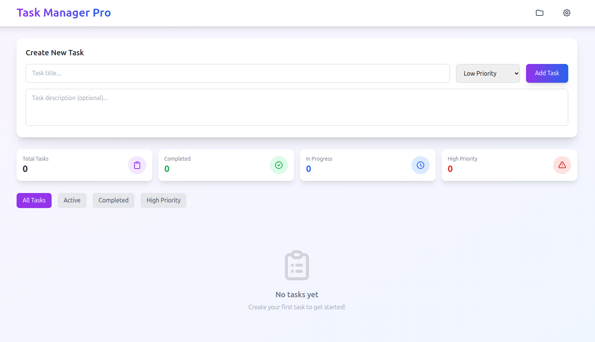
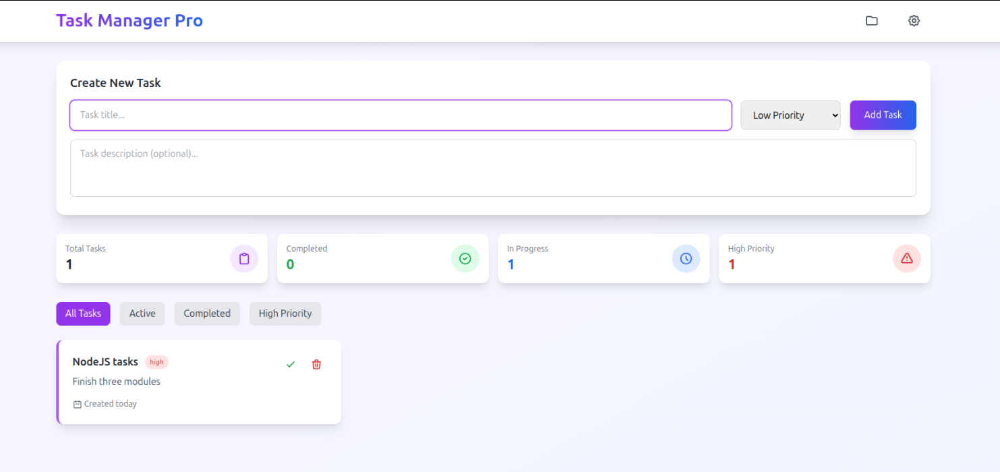
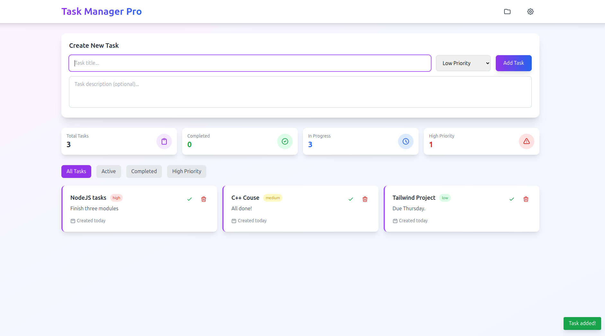

# Task Manager Pro

A modern, responsive, and accessible task management web app built with **vanilla JavaScript** (no frameworks) and Tailwind CSS.  
**Create, organize, and track your tasks with ease, powered by pure JavaScript.**

---

## 🚀 Live Demo

👉 [Try Task Manager Pro on Netlify](https://task-management-s.netlify.app/)

---

## ✨ Features

- **Add, complete, and delete tasks** with title, priority, and description
- **Persistent storage** using `localStorage` for data retention
- **Live stats**: Track total, completed, in-progress, and high-priority tasks
- **Filter tasks** by status or priority
- **Responsive UI** with Tailwind CSS, custom animations, and favicon support
- **Accessible**: ARIA labels, keyboard navigation, and semantic HTML
- **Instant feedback**: Toast notifications for user actions
- **Smooth animations** for adding/removing tasks
- **Modular codebase** using ES6 modules and vanilla JavaScript
- **Code quality**: Linting with ESLint 

---

## 📸 Screenshots





---

## 🛠️ Getting Started

### 1. **Clone the repository**

```sh
git clone https://github.com/Abdulrahman-Nasser0/TaskManager.git
cd TaskManager
```

### 2. **Install dependencies**

```sh
npm install
```

### 3. **Run locally**

Open `index.html` directly in a browser or use a local server:

```sh
npx serve .
```

---

## 🗂️ Project Structure

```
assets/
  scripts/
    task.js         # Task class and date formatting (vanilla JS)
    storage.js      # LocalStorage utilities (vanilla JS)
    taskManager.js  # Main app logic and UI (vanilla JS)
  styles/
    styles.css      # Tailwind CSS with custom animations
  icons/
    favicon.ico     # Website favicon
index.html          # Main HTML file
README.md
package.json        # NPM config for linting 
```

---

## 🧑‍💻 Development

- **Linting (ESLint)**: Ensure code quality for vanilla JavaScript  
  ```sh
  npm run lint
  ```

- **Formatting**: Auto-format code with Prettier  
  ```sh
  npm run format
  ```

---

## 🌐 Deployment

This project is continuously deployed on [Netlify](https://www.netlify.com/).

- **Production URL**:  
  [https://task-management-s.netlify.app/](https://task-management-s.netlify.app/)

To deploy your own fork:
1. Push to GitHub
2. Connect your repo to Netlify
3. Set build command to `npm run build` (if applicable) and publish directory to `/`

---

## ♿ Accessibility

- Forms and buttons include ARIA labels and roles
- Full keyboard navigation support
- Toast notifications use `aria-live` for screen reader compatibility


---

## 🙏 Credits

- [Tailwind CSS](https://tailwindcss.com/) for styling
- [Netlify](https://www.netlify.com/) for hosting
- [ESLint](https://eslint.org/) for linting vanilla JavaScript

---

> _Built with ❤️ using vanilla JavaScript by Abdulrahman — July 2025_
